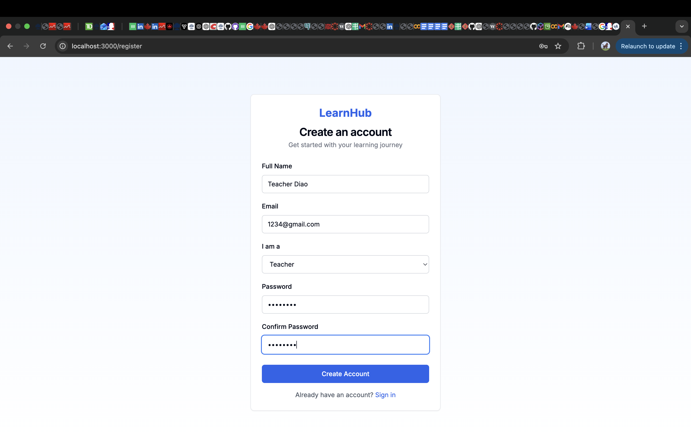
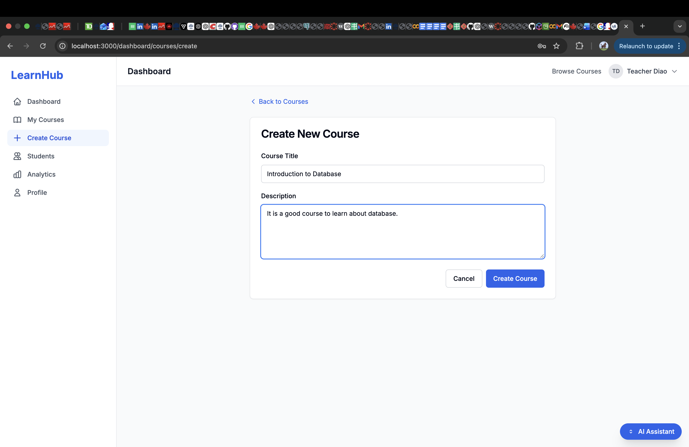
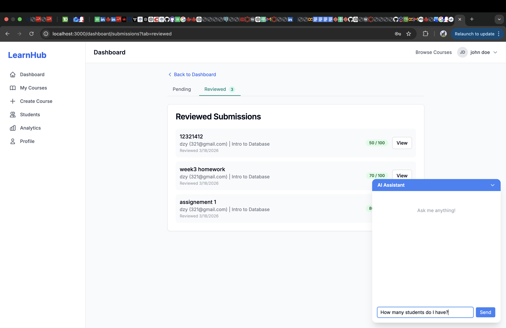
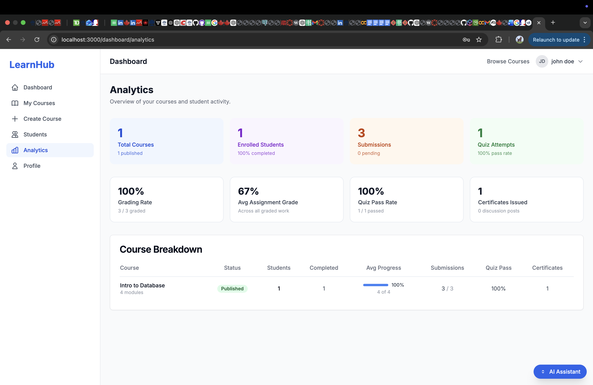
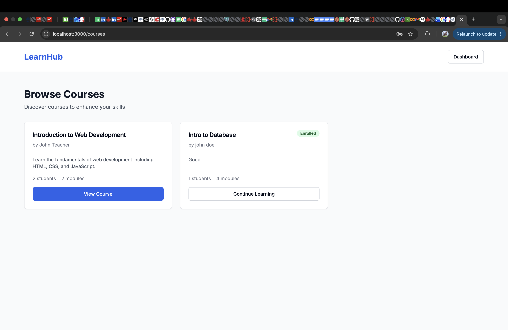
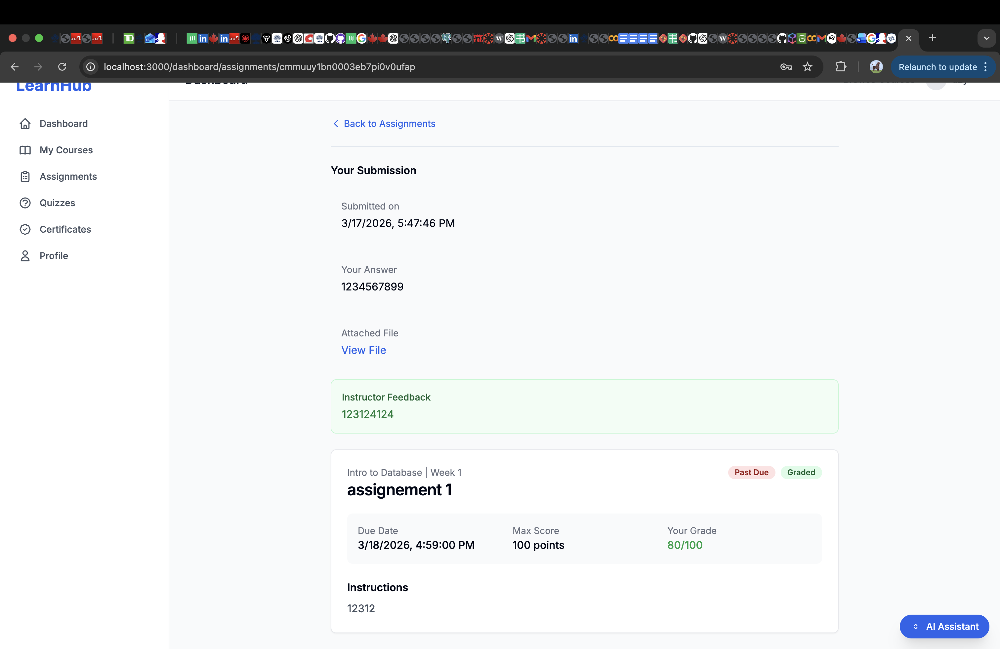
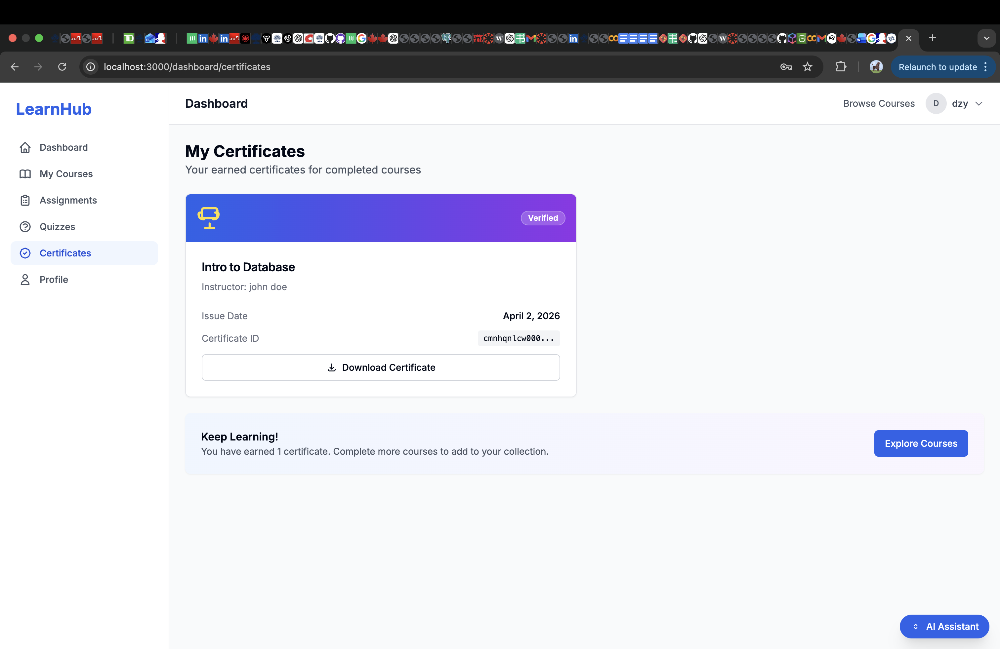
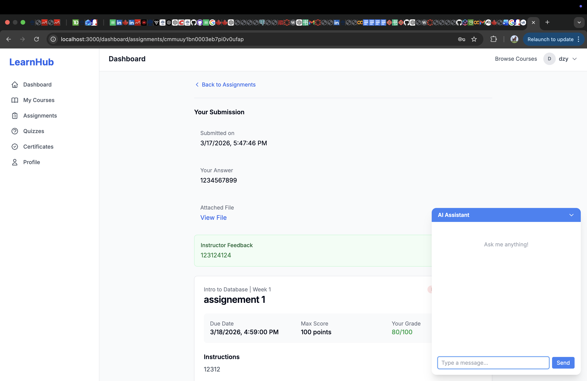

# Final Report

## Team Information

| Name | Student Number | Email |
|------|---------------|-------|
| [Housen Zhu] | [1008117477] | [benjamin.zhu@mail.utoronto.ca] |
| [Zhiyuan Diao] | [1002315014] | [zhiyuan.diao@mail.utoronto.ca] |
| [Tianrui Du] | [1005747417] | [sophieee.du@mail.utoronto.ca] |

## Video Demo

https://www.youtube.com/watch?v=XEOUFniIkoA

## Motivation

### Problem Statement

As education increasingly shifts toward digital and hybrid formats, learning management systems have become central to course delivery. However, many existing platforms primarily serve as content repositories rather than interactive, personalized learning environments. Educators typically upload slides, PDFs, and recorded lectures, but tools for meaningful engagement, progress tracking, and integrated feedback are often limited.

Students may struggle to monitor their performance, stay motivated, or receive timely insights into their learning progress. At the same time, educators frequently rely on multiple disconnected systems for assignments, grading, communication, and deadline management. This fragmentation increases administrative workload and creates an inconsistent user experience. The lack of integration between content delivery, assessment, analytics, and discussion tools results in inefficiencies for both teachers and students.

### Rationale and Significance

The proposed Personalized Learning Platform addresses these issues by consolidating essential educational functions into a unified system. It integrates role-based authentication, course management, quizzes and assignments, progress tracking, discussion forums, calendar support, and certificate generation within a single platform.

Using PostgreSQL for structured relational data and cloud storage for scalable content management ensures reliability and performance. Students benefit from clear visibility into deadlines, grades, and completion status, supporting accountability and engagement.

As digital learning continues to expand, there is a growing need for platforms that prioritize usability, integration, and personalized feedback. This project addresses that need while demonstrating practical full-stack engineering skills applied to a real-world educational challenge.

### Target User Groups

The primary users are educators and students. Educators require tools to create and manage courses, distribute materials, evaluate assignments, and monitor student progress. Students need structured learning paths, interactive assessments, timely feedback, and collaborative discussion spaces. Educational institutions and training organizations may also benefit from a centralized, scalable solution.

## Objectives

The primary objective of this project is to design and implement a full-stack Personalized Learning Platform that supports both educators and students in a structured and interactive learning environment.

Specifically, our team aimed to:

- Develop a centralized system for course creation, content delivery, and learning management.
- Enable personalized learning experiences through progress tracking, analytics, and feedback.
- Support core educational workflows, including course enrollment, assignments, quizzes, and grading.
- Implement role-based access control to ensure proper functionality for teachers and students.
- Integrate advanced features, such as real-time discussion forums, certificate generation, and deadline tracking.
- Demonstrate practical knowledge of modern full-stack technologies, including:
  - Next.js (App Router)
  - TypeScript
  - PostgreSQL with Prisma
  - Cloud storage integration
  - Authentication and authorization systems

Overall, the project aims to deliver a scalable, user-friendly, and technically robust platform that reflects real-world software engineering practices while addressing key challenges in digital education.

## Technical Stack

- **Chosen approach:** **Next.js Full-Stack** (App Router). We implemented both frontend UI and backend API routes in one codebase.
- **Language:** TypeScript for both client and server logic.
- **Frontend/UI:** React, Tailwind CSS, Radix UI primitives, and reusable custom UI components.
- **Backend/API:** Next.js route handlers and server components; server-side actions for course and analytics operations.
- **Authentication & Authorization:** better-auth with session-based login and role-aware routing for **STUDENT** and **TEACHER** users.
- **Database solution:** PostgreSQL with Prisma ORM (`prisma/schema.prisma`) and Prisma Client.
- **Database tooling:** Prisma schema migration/push workflows, Prisma Studio, and seed script (`prisma/seed.ts`).
- **Cloud storage:** AWS S3-compatible file upload integration for course content, submissions, and certificates.
- **Validation and utilities:** Zod for schema validation, date-fns for date handling, and shared utility modules.
- **Build/dev tooling:** Next.js build pipeline, ESLint, PostCSS, and TypeScript compiler checks.

## Features

The system supports end-to-end learning management workflows for both instructors and students.

1. **Role-based dashboards**
	- Separate teacher and student experiences after login.
	- Supports course management, learning progress tracking, and activity summaries.

2. **Course lifecycle management (Teacher)**
	- Create, edit, publish/unpublish courses.
	- Structure courses into modules and attach content, assignments, and quizzes.
	- Meets project requirements for instructor-side course administration.

3. **Enrollment and learning flow (Student)**
	- Browse courses, enroll, view course content, and continue learning.
	- Dashboard and course pages show progress bars and learning status.
	- Supports objective of providing guided, trackable learning progression.

4. **Assignments and grading**
	- Students submit assignment work (text/file).
	- Teachers review, grade, and provide feedback.
	- Includes pending/reviewed submission views to streamline review workflow.

5. **Quizzes and attempts**
	- Quiz attempts are stored with pass/fail outcomes and scores.
	- Enables measurable assessment and contributes to course progress analytics.

6. **Analytics and reporting**
	- Teacher analytics dashboard for course-level metrics.
	- Course-specific analytics tab includes enrollment, completion, grading, and module breakdown.
	- Directly supports objective of data-informed teaching decisions.

7. **Certificates**
	- Certificates generated and displayed for completed learning outcomes.
	- Verifiable listing and downloadable certificate files.

8. **Integrated AI chatbot**
	- In-dashboard assistant for quick support.
	- Includes minimize/expand interaction to avoid interrupting core workflows.

Overall, these features satisfy typical course-project requirements: authentication, role-based access, CRUD data management, analytics, file handling, and production-style full-stack architecture.

## User Guide

> Add screenshots in the indicated places (recommended filenames shown below).

### 1) Sign in and access dashboard
1. Open the app URL.
2. Log in with a valid teacher or student account.
3. You will be redirected to the role-specific dashboard.

### 2) Teacher workflow

#### A. Create and publish a course
1. Go to **Dashboard -> My Courses -> Create Course**.
2. Enter course title/description and save.
3. Open the created course and add modules.
4. Add content, assignments, and quizzes inside modules.
5. Publish the course when ready.

#### B. Review submissions
1. Go to **Dashboard -> Submissions**.
2. Use **Pending** tab to open ungraded work.
3. Enter grade + feedback and submit review.
4. Check **Reviewed** tab to confirm graded items.

#### C. View analytics
1. Go to **Dashboard -> Analytics** for platform-level teacher metrics.
2. Open a specific course and select the **Analytics** tab for course-level insights.

### 3) Student workflow

#### A. Enroll and learn
1. Browse available courses.
2. Enroll in a course.
3. Open **Dashboard -> My Courses** and continue from the course page.

#### B. Submit assignments and take quizzes
1. Inside a course, open an assignment and submit required work.
2. Open quizzes and complete attempts.
3. Track status from dashboard pages.

#### C. Check certificates
1. Open **Dashboard -> Certificates**.
2. View earned certificates and download available files.

### 4) Use chatbot assistant
1. Use the floating chatbot in dashboard pages.
2. Ask questions related to learning/workflow.
3. Minimize or expand the chatbot as needed.

## Development Guide

### Environment setup and configuration

1. **Prerequisites**
	- Node.js **20 LTS** (recommended for stable Next.js behavior)
	- npm (bundled with Node)
	- PostgreSQL running locally

2. **Install dependencies**
	- Run: `npm install`

3. **Configure environment variables**
	- Copy `.env.example` to `.env`.
	- Set at minimum:
	  - `DATABASE_URL`
	  - `BETTER_AUTH_SECRET`
	  - `BETTER_AUTH_URL`
	  - `NEXT_PUBLIC_APP_URL`

4. **Role/auth considerations**
	- Ensure seed users or test users exist for both `TEACHER` and `STUDENT` roles.

### Database initialization

1. Generate Prisma client:
	- `npm run db:generate`

2. Sync schema to database:
	- `npm run db:push`

3. Seed initial data:
	- `npm run db:seed`

4. (Optional) Inspect DB in Prisma Studio:
	- `npm run db:studio`

If migrations are preferred in your workflow, use `npm run db:migrate` instead of `db:push`.

### Cloud storage configuration

The project supports S3-backed file storage.

1. In `.env`, set:
	- `AWS_ACCESS_KEY_ID`
	- `AWS_SECRET_ACCESS_KEY`
	- `AWS_S3_BUCKET`
	- `AWS_S3_REGION`

2. Keep upload folder conventions used by the app (`courses`, `assignments`, `submissions`, `certificates`, `profiles`).

3. Verify bucket permissions/CORS allow app uploads and file retrieval.

4. For local-only testing, you may keep these values unset if your storage layer has fallback behavior.

### Local development and testing

1. Start development server:
	- `npm run dev`

2. Open:
	- `http://localhost:3000`

3. Recommended manual test checklist:
	- Login/logout for both roles.
	- Teacher: create/publish course, add module/content/assignment/quiz.
	- Student: enroll, submit assignment, attempt quiz.
	- Teacher: grade submission and verify reviewed tab updates.
	- Verify progress bars on dashboard and courses pages.
	- Verify analytics pages/tabs display expected metrics.
	- Verify certificate listing/download behavior.
	- Verify chatbot send/minimize/expand behavior.

4. Build verification:
	- `npm run build`

5. Lint checks:
	- `npm run lint`

## AI Assistance & Verification (Summary)

### Where AI meaningfully contributed

AI tools were used as a **supporting engineering assistant** in targeted stages of development rather than as a primary source of implementation:

- **Architecture and workflow exploration:** validating high-level design decisions such as role-based access control (Teacher vs Student), dashboard structure, and decomposition of features (analytics, certificates, assignments) into manageable components.
- **Database and query design support:** drafting and refining **Prisma query structures**, especially for nested relationships (e.g., progress tracking, submission status, analytics aggregation, and certificate eligibility). Outputs were adapted to match the actual schema and constraints.
- **Debugging and issue isolation:** identifying possible causes for issues such as inconsistent progress calculations, UI state mismatches, and route/runtime inconsistencies (e.g., dashboard and chatbot behavior).
- **Edge case and validation reasoning:** suggesting handling for incomplete submissions, grading updates, and ensuring certificate eligibility logic aligned with system rules.
- **Documentation support:** improving clarity, structure, and alignment with assignment requirements.

AI outputs were treated as **suggestions**, not authoritative solutions, and were reviewed before integration.

### One representative mistake or limitation in AI output

A representative limitation was an **initially inconsistent progress calculation model**. The AI-generated approach mixed **module-level completion** with **assessment-level completion**, resulting in misleading progress percentages (e.g., low completion despite quizzes and assignments being finished).

The team identified this issue through testing and revised the logic to a clearer rule based strictly on:

- **passed quizzes**, and  
- **completed assignments**

This demonstrated that AI-generated solutions can appear correct but may contain **hidden logical inconsistencies** when applied to real system requirements.

More detailed examples, prompts, and corrections are documented in **ai-session.md**.

### How correctness was verified

All AI-assisted outputs were verified using standard engineering practices rather than being accepted directly:

- **Manual end-to-end user flow testing:** verifying teacher and student workflows, including course creation, enrollment, submissions, grading, analytics updates, certificate generation, and chatbot behavior.
- **Data-level validation:** ensuring progress, submission status, grading results, and certificate eligibility matched database records and expected outcomes.
- **Type safety and runtime validation:** resolving TypeScript errors and runtime issues before accepting changes.
- **Incremental and regression testing:** re-testing related components (dashboard, course pages, analytics, certificates) after each change to prevent unintended side effects.
- **Cross-checking with system requirements:** ensuring AI-generated logic aligned with defined rules such as role permissions, grading criteria, and completion logic.

Concrete session-level evidence is referenced in **ai-session.md**.

## Individual Contributions

| Team Member      | Area of Contribution              | Specific Contributions (Based on Git History) |
|-----------------|----------------------------------|----------------------------------------------|
| **Zhiyuan Diao** | Architecture & Core Development   | - Built basic backend functions and frontend structure - Implemented assignment and quiz pages - Added cloud storage integration - Developed teacher review workflow for assignments - Added student UI features and fixed due date display bugs - Implemented analytics page, progress tracking, and course analytics - Added certificate generation feature - Updated README and AI assistance section - Fixed markdown rendering and minor technical issues |
| **Housen Zhu**   | Proposal & Feature Support        | - Created initial repository and project proposal - Refined objectives, features, and technical implementation sections - Improved alignment with course requirements and project scope - Updated AI assistance disclosure and documentation clarity - Contributed to chatbot/dashboard feature - Managed pull requests and collaborative merges |
| **Tianrui Du**   | Documentation & Planning          | - Contributed to proposal writing and refinement (Sections 2, 4, 5) - Improved alignment with course requirements - Drafted and answered Section 4 questions - Added and refined major proposal sections - Reduced word count and improved clarity for submission quality |

### Overall Collaboration

In addition to individual tasks, the team collaborated through pull requests and merges to integrate work into a consistent final project. The commit history shows an organized workflow where proposal writing, feature implementation, and documentation updates were completed incrementally and then merged into the main branch.

## Lessons Learned and Concluding Remarks

This project helped our team gain practical experience in planning and building a full-stack application within a limited timeline. One of the most important lessons we learned was the value of carefully controlling project scope. At the proposal stage, many features seemed desirable, but during development we realized that feasibility, stability, and integration were more important than simply adding complexity. This led us to focus on the features that delivered the most value while remaining realistic to implement.

We also learned the importance of clear responsibility division and version control discipline. Since different members worked on architecture, core workflow, advanced features, and documentation, maintaining coordination through Git commits and pull requests was essential. The commit history made it easier to track progress, integrate changes, and ensure accountability for each team member’s work.

From a technical perspective, the project gave us experience with Next.js full-stack development, relational data modeling, authentication, storage integration, and feature coordination across frontend and backend layers. We also saw firsthand how seemingly simple educational features—such as progress tracking, grading, file handling, and certificate generation—require careful data design and validation logic.

Overall, this project was a valuable experience because it combined technical implementation, collaboration, planning, and iterative refinement. It reinforced the importance of building systems that are not only functional, but also maintainable, secure, and aligned with real user needs. We believe the final result reflects both our technical growth and our ability to work effectively as a development team.
